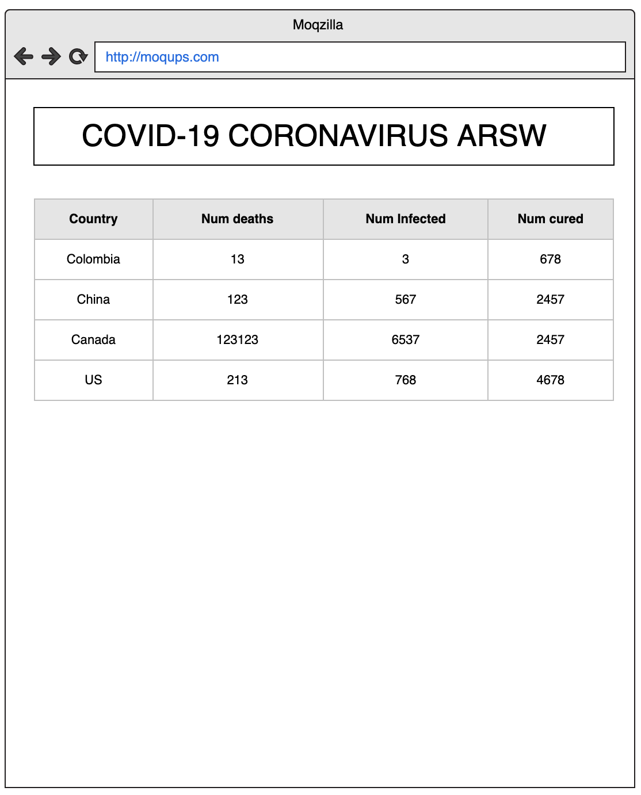
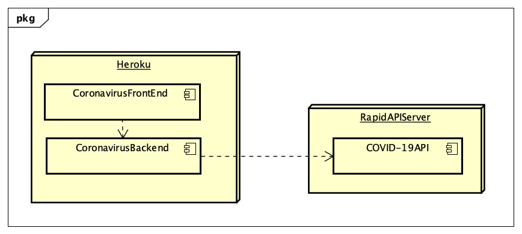

# ParcialT2AnaSalazarARSW

Parcial seguno tercio de arquitectura de software

## Correr proyecto

Primero clonaremos el repositorio, para eso desde nuestro navegador nos dirigiremos al siguiente link

```sh
https://github.com/anamariasalazar/ParcialT2AnaSalazarARSW
```

Para clonar el repositorio debemos de correr el siguiente comando en cmd o en la terminal 

```sh
https://github.com/anamariasalazar/ParcialT2AnaSalazarARSW
 ```

## Correr Pruebas

Para correr las pruebas, ejecutamos el siguiente comando

```sh
$ mvn test
 ```
## Extensión

Dado que esta arquitectura fue desarrollada con el principio de inyección de dependencias, resulta muy sencillo hacer uso de las extensiones, ya que si se desea consumir recursos de otras API's solo se deben realizar las respectivas extensiones y luego incluírlas en el sistema.

 
## Construido con

* [Maven](https://maven.apache.org/) - Dependency Management
* [JUnit](https://mvnrepository.com/artifact/junit/junit) - Test framework
* [VIM](https://www.vim.org/download.php) - Editor de Texto VIM

## Author

 - Ana Maria Salazar Bohorquez 

 
## Preparación para el Parcial

Con el objetivo de preparar el examen final del segundo tercio, por favor siga las siguientes instrucciones.

1. Explore el API de COVID-19 Coronavirus Statistics en el siguiente [enlace](https://rapidapi.com/KishCom/api/covid-19-coronavirus-statistics)
2. Use la colección de Postman adjunta para validar el funcionamiento del endpoint por fuera de la página de RappidAPI.
3. Si no ha terminado por completo el último laboratorio, hagalo, si es necesario desde el inicio y completo. En ese laboratorio esta basado el parcial.
4. Revise la documentación de Google Maps para agregar marcadores a un mapa o revise este [Codepen](https://codepen.io/SitePoint/pen/YWKLzv?editors=0110)

## Descripción del Problema a Solucionar

Usted está muy preocupado por la situación sanitaria que atraviesa el mundo debido al virus COVID-19 popularmente llamado Coronavirus. Es por eso que usted decidió hacer una aplicación web informativa donde se pueda leer fácilmente información estádistica al respecto.

La aplicación mostrará inicialmente una estádistica general en la cuál se pueden listar todos los paises que presentán casos de infección confirmados, muertes y finalmente personas curadas. Esta lista deberá aparecer ordenada por los siguientes criterios:

 - Número de muertes.
 - Número de infectados.
 - Número de curados.

Adicionalmente cuando el usuario de la aplicación haga click sobre el nombre de un país determinado, usted debe mostrar la misma información (casos de infección confirmados, muertes y personas curadas) solo que en esta ocasión debe hacerlo no de manera consolidada sino que debe expandir la información por provincia. (Pruebe con China, Canada o US, países con múltiples provisncias infectadas).

Para obtener dicha información utilice el API gratuito de [COVID-19 Coronavirus Statistics](https://rapidapi.com/KishCom/api/covid-19-coronavirus-statistics) el cual usted debió estudiar previamente antes de este examen.

Se le pide que su implementación sea eficiente en cuanto a recursos así que debe implementar un caché que permita evitar hacer consultas repetidas al API externo cuando consulte las estadisticas para un país especifico.



Una vez tenga la funcionalidad básica, extienda su implementación para incluir un mapa en el cual resalte con un indicador la ubicación del país seleccionado por el usuario (revise la funcionalidad del API de mapas y el ejemplo anexo.).

Como el API del coronavirus no brinda información sobre la latitud y longitud del país consultado, apoyese en este [API](https://rapidapi.com/apilayernet/api/rest-countries-v1?endpoint=53aa5a09e4b051a76d24136a). AJUSTE LOS DIAGRAMAS DE ARQUITECTURA QUE SEAN NECESARIOS PARA REFLEJAR EL USO DE ESTE COMPONENTE.


Sugerencia realice la implementación de manera incremental. Haga commits regulares.

## Requerimientos de Arquitectura

 1. El cliente Web debe ser un cliente asíncrono que use servicios REST desplegados en Heroku y use JSON como formato para los mensajes.
 2. El servidor de Heroku servirá como un gateway para encapsular llamadas a otros servicios Web externos.
 3. La aplicación debe ser multiusuario (Sin registro y sin seguridad)
 4. Todos los protocolos de comunicación serán sobre HTTP.
 5. La interfaz gráfica del cliente debe ser los más limpia y agradable posible y debe utilizar Bootstrap. Para invocar métodos REST desde el cliente usted puede utilizar la tecnología que desee.
 6. La fachada de servicios tendrá un caché que permitirá que llamados que ya se han realizado a las implementaciones concretas con parámetros específicos no se realicen nuevamente. Puede almacenar el llamado como un String con su respectiva respuesta, y comparar el string respectivo. Recuerde que el caché es una estructura de datos. (Hashmap por ejemplo)
 7. Se debe poder extender fácilmente, por ejemplo, es fácil agregar nuevas funcionalidades, o es fácil cambiar el proveedor de una funcionalidad.
 8. Debe utilizar maven para gestionar el ciclo de vida, git y GitHub para almacenar al código fuente y Heroku como plataforma de producción.

### Diagrama de Despliegue



### Diagrama de Componentes


## Requerimientos de Entrega

1.  La aplicación funcionando en Heroku con el nombre (NOMBRE-APELLIDO-ARSW-T2) y el código fuente almacenado en un proyecto GitHub con el nombre (NOMBRE-APELLIDO-ARSW-T2).
2.  Los fuentes deben estar documentados y bien estructurados para generar el Javadoc.
3.  El README.md debe describir:
	1. El diseño de arquitectura. 
	2. La forma de ejecutar el programa localmente. 
	3. Explicar cómo se puede extender y cómo podría, por ejemplo, hacer que una función específica la implementara un proveedor de servicios diferente.
	4. Indique la urls de Heroku
    5. Indique si hizo los bonos y una evidencia de su ejecución.
4.  Suba el zip del proyecto al aula con el nombre (NOMBRE-APELLIDO-ARSW-T2).
5.  Guarde una copia de su proyecto.

> IMPORTANTE! El parcial que no sea subido a tiempo o que no cumpla al pie de la letra con las condiciones de entrega, será calificado con 0.0 sin lugar a reclamaciones, ya que las condiciones están claras.

